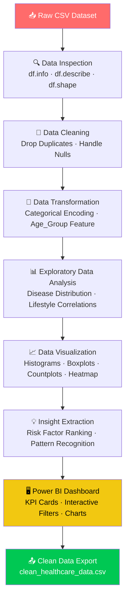

<div align="center">

<!-- Animated Header Banner -->


<!-- Typing Animation -->
<a href="https://git.io/typing-svg">
  
</a>

<br/>

<!-- Core Badges -->
[](https://python.org)
[](https://pandas.pydata.org)
[](https://numpy.org)
[](https://seaborn.pydata.org)
[](https://matplotlib.org)
[](https://powerbi.microsoft.com)
[](https://jupyter.org)
[](https://microsoft.com/excel)
[](https://github.com)

<br/>

<!-- Status Badges -->


</div>

---

## 📖 Table of Contents

<details>
<summary><b>Click to Expand Navigation Menu</b></summary>

- [🧩 Problem Statement](#-problem-statement)
- [🎯 Project Objectives](#-project-objectives)
- [💡 Value Proposition](#-value-proposition)
- [📊 Dataset Overview](#-dataset-overview)
- [🛠️ Tech Stack](#️-tech-stack)
- [⚙️ Project Workflow](#️-project-workflow)
- [📈 Key Findings & Insights](#-key-findings--insights)
- [📊 Visualizations Produced](#-visualizations-produced)
- [🖥️ Power BI Dashboard](#️-power-bi-dashboard)
- [📁 Project Structure](#-project-structure)
- [🚀 Getting Started](#-getting-started)
- [🌟 Future Roadmap](#-future-roadmap)
- [👨‍💻 Author](#-author)

</details>

---

## 🧩 Problem Statement

<div align="center">
<table>
<tr>
<td align="center" width="33%">

### 😰 Pain Point
Healthcare systems worldwide struggle to **proactively identify at-risk patients** before diseases manifest into critical conditions. Clinicians are overwhelmed with reactive treatment rather than preventive care.

</td>
<td align="center" width="33%">

### 🔍 The Gap
Massive amounts of **patient lifestyle and biometric data** go unanalyzed. There is no systematic way to connect smoking habits, BMI, family history, and exercise patterns to concrete disease outcomes.

</td>
<td align="center" width="33%">

### 💊 The Cost
Late-stage disease detection leads to **higher treatment costs, reduced survival rates**, and avoidable hospital burdens — all of which could be mitigated with data-informed, early interventions.

</td>
</tr>
</table>
</div>

---

## 🎯 Project Objectives

```
╔══════════════════════════════════════════════════════════════════╗
║                    🎯  PROJECT TARGETS                           ║
╠══════════════════════════════════════════════════════════════════╣
║  ✅  Analyze ~1000 patient health records end-to-end             ║
║  ✅  Identify top disease risk factors (BMI, smoking, age)       ║
║  ✅  Quantify how lifestyle habits correlate with 4 diseases     ║
║  ✅  Segment patients by age group for targeted insights         ║
║  ✅  Build interactive Power BI dashboard for stakeholders       ║
║  ✅  Generate clean, exportable dataset for further use          ║
╚══════════════════════════════════════════════════════════════════╝
```

---

## 💡 Value Proposition

<div align="center">

| 👥 Who Benefits | 🎁 What They Get | 📌 Why It Matters |
|:---|:---|:---|
| **Clinicians & Doctors** | Visual risk profiles per patient cohort | Faster, evidence-based clinical decisions |
| **Healthcare Administrators** | KPI dashboards on disease burden | Optimized resource allocation |
| **Public Health Officials** | Lifestyle-disease correlation maps | Targeted prevention campaigns |
| **Researchers** | Clean, structured dataset + EDA | Foundation for ML/AI disease models |
| **Patients** | Awareness of modifiable risk factors | Empowerment to change lifestyle habits |

</div>

---

## 📊 Dataset Overview

<div align="center">

```
┌─────────────────────────────────────────────────────────────────┐
│                     📋  DATASET SNAPSHOT                        │
├─────────────────────────────────────────────────────────────────┤
│   📦  Source        :  Healthcare Disease Prediction CSV        │
│   👥  Records       :  ~1000 patients                          │
│   🔢  Features      :  12 variables                            │
│   🎯  Target Labels :  Heart Disease, Diabetes, Stroke, Cancer │
└─────────────────────────────────────────────────────────────────┘
```

</div>

### 🔑 Feature Breakdown

| Category | Features | Type |
|:---|:---|:---|
| 🧍 **Demographics** | Age, Gender | Numerical / Categorical |
| 🩺 **Biometrics** | BMI, Blood Pressure | Numerical (Continuous) |
| 🚬 **Lifestyle** | Smoking, Alcohol Consumption, Exercise | Categorical → Encoded |
| 🧬 **Medical History** | Family History | Categorical → Encoded |
| 🦠 **Disease Labels** | Heart Disease, Diabetes, Stroke, Cancer | Binary (0/1) |
| 📅 **Engineered** | Age_Group (Young/Adult/Senior/Old) | Ordinal |

---

## 🛠️ Tech Stack

<div align="center">

| Layer | Tool | Purpose |
|:---:|:---:|:---|
|  | **Python 3.10+** | Core analysis language |
|  | **Pandas** | Data loading, cleaning, transformation |
|  | **NumPy** | Numerical computations & statistics |
|  | **Matplotlib** | Base plotting layer |
|  | **Seaborn** | Statistical visualizations |
|  | **Jupyter Notebook** | Interactive development environment |
|  | **Power BI Desktop** | Business intelligence dashboard |
|  | **Microsoft Excel** | Initial data storage & review |
|  | **Git & GitHub** | Version control & collaboration |

</div>

---

## ⚙️ Project Workflow



### Step-by-Step Breakdown

<details>
<summary>📥 <b>Step 1 — Data Loading</b></summary>

```python
import numpy as np
import pandas as pd
import matplotlib.pyplot as plt
import seaborn as sns
import statistics

df = pd.read_csv("healthcare_disease_prediction_dataset.csv")
```
</details>

<details>
<summary>🔍 <b>Step 2 — Data Inspection</b></summary>

```python
df.head()        # First 5 rows
df.tail()        # Last 5 rows
df.info()        # Column types & non-null counts
df.describe()    # Summary statistics
df.shape         # (rows, columns)
df.columns       # All feature names
```
</details>

<details>
<summary>🧹 <b>Step 3 — Data Cleaning</b></summary>

```python
df.isnull().sum()           # Check missing values per column
df.isnull().sum().sum()     # Total null count
df.drop_duplicates(inplace=True)  # Remove duplicate records
```
> ✅ Dataset was largely clean — minimal null values found.
</details>

<details>
<summary>🔄 <b>Step 4 — Data Transformation</b></summary>

```python
# Encode categorical variables to numeric
df['Gender']             = df['Gender'].map({'Male': 1, 'Female': 0})
df['Smoking']            = df['Smoking'].map({'Yes': 1, 'No': 0})
df['Alcohol Consumption']= df['Alcohol Consumption'].map({'Yes': 1, 'No': 0})
df['Exercise']           = df['Exercise'].map({'Yes': 1, 'No': 0})
df['Family History']     = df['Family History'].map({'Yes': 1, 'No': 0})

# Engineer Age Groups
df['Age_Group'] = pd.cut(df['Age'],
                          bins=[0, 30, 50, 70, 100],
                          labels=['Young', 'Adult', 'Senior', 'Old'])
```
</details>

<details>
<summary>📊 <b>Step 5 — EDA & Visualization</b></summary>

```python
# Disease Distribution
diseases = ['Heart Disease', 'Diabetes', 'Stroke', 'Cancer']
for d in diseases:
    print(df[d].value_counts())

# Lifestyle vs Disease
sns.countplot(x='Smoking', hue='Heart Disease', data=df)
sns.histplot(df['Age'], bins=20)
sns.boxplot(x='Heart Disease', y='BMI', data=df)
sns.countplot(x='Gender', hue='Diabetes', data=df)
sns.countplot(x='Exercise', hue='Stroke', data=df)
```
</details>

---

## 📈 Key Findings & Insights

<div align="center">

> ### 🔬 What the Data Revealed

</div>

```
🔴  HIGH BMI  ──────────────────►  ↑ Heart Disease Risk
🚬  SMOKING   ──────────────────►  ↑ Heart Disease + Cancer Risk  
🍺  ALCOHOL   ──────────────────►  ↑ Liver & Stroke Risk
👴  OLD AGE   ──────────────────►  ↑ Risk Across All 4 Diseases
🏃  EXERCISE  ──────────────────►  ↓ Disease Probability (Protective)
🧬  FAMILY HISTORY ─────────────►  ↑ Strongest Non-Modifiable Risk
```

| # | Insight | Actionable Implication |
|:--|:---|:---|
| 1 | 🔴 **High BMI → Heart Disease** | Weight management programs for at-risk patients |
| 2 | 🚬 **Smokers have significantly higher disease rates** | Smoking cessation as a public health priority |
| 3 | 🍺 **Alcohol consumption amplifies multiple disease risks** | Early counseling for alcohol users |
| 4 | 👴 **Senior & Old age groups dominate disease records** | Routine screening programs for 50+ age group |
| 5 | 🏃 **Exercise acts as a strong disease protector** | Exercise prescription in preventive care plans |
| 6 | 🧬 **Family history is the top non-modifiable risk factor** | Genetic-aware screening protocols |

---

## 📊 Visualizations Produced

| Plot Type | Variable(s) | Purpose |
|:---|:---|:---|
| 📊 **Histogram** | Age | Patient age distribution across dataset |
| 📦 **Box Plot** | BMI vs Heart Disease | BMI spread comparison for diseased vs healthy |
| 📊 **Count Plot** | Smoking vs Heart Disease | Smoking's direct impact on heart disease |
| 📊 **Count Plot** | Gender vs Diabetes | Gender-based diabetes prevalence |
| 📊 **Count Plot** | Exercise vs Stroke | Exercise as protective factor for stroke |
| 🌡️ **Heatmap** | All features | Full feature correlation matrix |

---

## 🖥️ Power BI Dashboard

<div align="center">

> **`dashboard/healthcare_dashboard.pbix`**

</div>

The Power BI dashboard provides an at-a-glance executive view of the entire dataset with 5 interactive filters and 5 chart panels.

### 📸 Dashboard Preview

<div align="center">


</div>

### 📊 Live KPIs

| KPI | Value | Insight |
|:---|:---:|:---|
| 👥 **Total Patients** | **1,000** | Full cohort size |
| 📅 **Average Age** | **52.88** | Middle-to-senior dominant cohort |
| ⚖️ **Average BMI** | **29.21** | Borderline overweight across population |
| ❤️ **Heart Disease Cases** | **253** | Highest disease burden — 25.3% of patients |
| 🩸 **Diabetes Cases** | **186** | Second most prevalent — 18.6% |
| 🧠 **Stroke Cases** | **134** | 13.4% of all patients |
| 🫁 **COPD Cases** | **101** | 10.1% — heavily lifestyle-linked |
| 🎗️ **Avg Cancer Rate** | **0.10** | 10% cancer incidence across cohort |

### 🎛️ Interactive Filters

| Filter | Options |
|:---|:---|
| 👤 Gender | Male / Female |
| 📅 Age Group | Young / Adult / Senior / Old |
| 🏃 Exercise | Yes / No |
| 🚬 Smoking | Yes / No |
| 🧬 Family History | Yes / No |

### 📈 Chart-by-Chart Analysis

| Chart | Visualization | Key Finding |
|:---|:---|:---|
| 🍩 **Cholesterol Distribution** | Donut Chart | **51.4% High** vs 48.6% Normal — nearly half the cohort at cholesterol risk |
| 📊 **Kidney Disease by Age Group** | Stacked Bar | Adult group highest (283 pts, 43 with KD); Young group lowest overall exposure |
| 📊 **Heart Disease by Age Group** | Grouped Bar | Adults carry heaviest burden (76/283 with HD); risk persists across all age groups |
| 📉 **Age & Gender Distribution** | Dual Line Chart | Both genders peak at ages 62–65; male slightly higher across most age bands |
| 🟥 **Diabetes × Blood Pressure × Family History** | Matrix Heatmap | Normal BP + Family History = **195 Yes** (highest risk combo); High BP alone = 179 No-family-history cases — BP is a strong independent trigger |

---

## 📁 Project Structure

```
Healthcare-Analytics-Project/
│
├── 📂 data/
│   ├── healthcare_disease_prediction_dataset.csv   ← Raw input
│   └── clean_healthcare_data.csv                  ← Cleaned output
│
├── 📂 notebooks/
│   └── Data_Analysis.ipynb                        ← Full EDA notebook
│
├── 📂 dashboard/
│   └── healthcare_dashboard.pbix                  ← Power BI file
│
├── 📂 images/
│   └── dashboard_preview.png                      ← Dashboard screenshot
│
└── README.md                                      ← You are here 👈
```

---

## 🚀 Getting Started

### Prerequisites


### Step 1 — Clone the Repository

```bash
git clone https://github.com/alam292/Healthcare-Analytics-Project.git
cd Healthcare-Analytics-Project
```

### Step 2 — Install Dependencies

```bash
pip install pandas numpy matplotlib seaborn jupyter
```

### Step 3 — Launch the Notebook

```bash
jupyter notebook notebooks/Data_Analysis.ipynb
```

### Step 4 — Open Power BI Dashboard

```
1. Install Power BI Desktop (free from Microsoft)
2. Open dashboard/healthcare_dashboard.pbix
3. Refresh data source pointing to data/clean_healthcare_data.csv
4. Explore with interactive filters!
```

---

## 🌟 Future Roadmap

```
Version 1.0  ✅  EDA + Visualization + Power BI Dashboard
     │
     ▼
Version 1.5  🔄  SQL Integration (PostgreSQL / SQLite backend)
     │
     ▼
Version 2.0  📌  Machine Learning Models (Logistic Regression, Random Forest)
     │
     ▼
Version 2.5  📌  Streamlit Web App for Live Predictions
     │
     ▼
Version 3.0  📌  Real-Time Patient Data via API + Cloud Deployment (Azure/AWS)
```

| Milestone | Feature | Status |
|:---|:---|:---:|
| 🔬 Core EDA | Python Analysis Notebook | ✅ Done |
| 📊 Dashboard | Power BI Interactive Report | ✅ Done |
| 🗄️ Database | SQL Integration | 🔄 Planned |
| 🤖 ML Models | Predictive Modeling | 📌 Upcoming |
| 🌐 Web App | Streamlit Deployment | 📌 Upcoming |
| ☁️ Cloud | Azure / AWS Real-Time Data | 📌 Future |

---

## 👨‍💻 Author

<div align="center">


### **Md Matloob Alam**

[](https://github.com/alam292)
[](https://www.linkedin.com/in/md-matloob-a-016408229/)
[](mailto:your@email.com)

*Data Analyst passionate about transforming healthcare data into actionable insights.*

</div>

---

<div align="center">

### ⭐ Found this project useful?

**Give it a star on GitHub and share it with your network!**

[](https://github.com/alam292/Healthcare-Analytics-Project)
[](https://github.com/alam292/Healthcare-Analytics-Project/fork)

<br/>


</div>